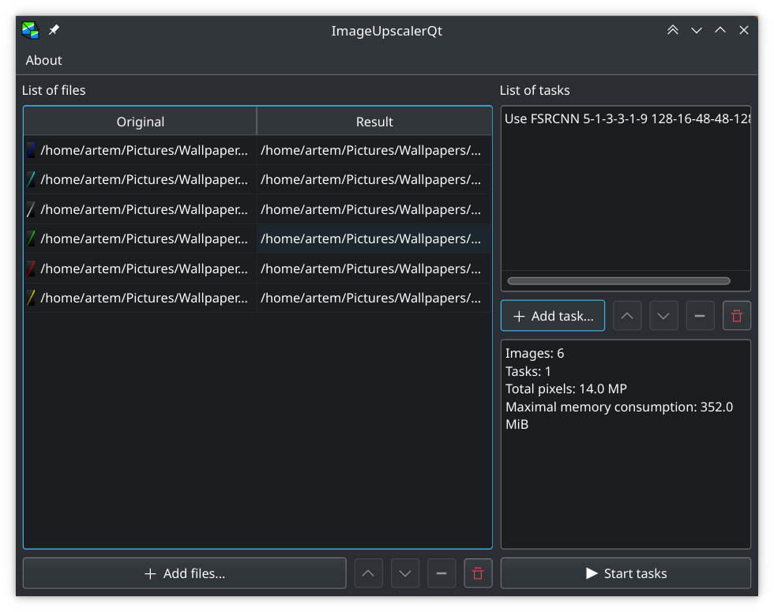
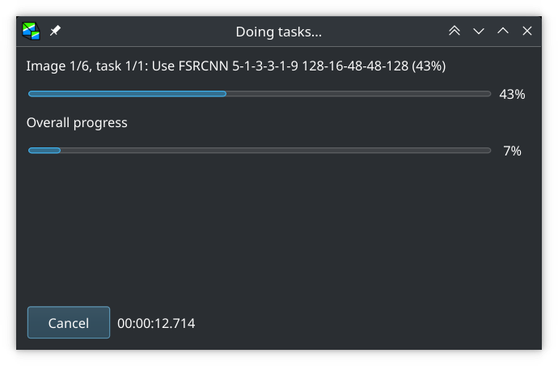

# ImageUpscalerQt

Contents:
* [How to use](#how-to-use)
* [Build from source](#source)
    * [Flatpak](#flatpak-build)
    * [Arch](#arch-build)
    * [Ubuntu](#ubuntu-build)
    * [Windows](#windows-build)

ImageUpscalerQt is a program for upscaling images using neural networks, but it also has other auxiliary functions.

Main functions:

* Resize with various interpolations.
* Use SRCNN (Super Resolution Convolutional Neural Network) of different architectures.
* Use FSRCNN (Fast Super Resolution Convolutional Neural Network) of different architectures.
* Convert color space (RGB to YCbCr, RGB to YCoCg and vice versa).

## How to use <a name="how-to-use"/>
1. Select the images you want to process using the **"Add files..."** button.
2. Now your files appeared in the table. Left column is input files, right column is output files.
3. Add a task using the **"Add task..."** button.
4. Every function of this program have its own task type. Select it.
5. Each task has it's own parameters.
6. When all the parameters are specified, click **"Ok"**.
7. Your task has appeared in the queue.
8. Click the **"Start tasks"** button.



9. Wait for tasks to be completed.

# Build from source <a name="source"/>
## Flatpak build <a name="flatpak-build"/>
```
# Download the manifest.
wget https://raw.githubusercontent.com/GRAPHENE9932/ImageUpscalerQt/master/com.graphene9932.ImageUpscalerQt.yml
# Build the flatpak and export it to repository.
flatpak-builder --repo=./repo ./app com.graphene9932.ImageUpscalerQt.yml
# Create a single-file bundle (optional).
flatpak build-bundle ./repo ImageUpscalerQt.flatpak com.graphene9932.ImageUpscalerQt
```
## For Arch Linux based distributions <a name="arch-build"/>
### Install dependencies
```
$ sudo pacman -S openimageio qt5-base cmake gcc python-pip wget unzip onednn
```
### Configure and compile
```
$ git clone https://github.com/GRAPHENE9932/ImageUpscalerQt.git
$ cd ImageUpscalerQt
$ mkdir build
$ cd build
$ cmake ..
$ make
```
## For Ubuntu 21.04 or newer <a name="ubuntu-build"/>
### Install dependencies
```
$ sudo apt install libopenimageio-dev qt5-default libdnnl-dev cmake gcc git python3-pip wget unzip
```
### Configure and compile
```
$ git clone https://github.com/GRAPHENE9932/ImageUpscalerQt.git
$ cd ImageUpscalerQt
$ mkdir build
$ cd build
$ cmake ..
$ make
```
## For Windows <a name="windows-build"/>

### Install Visual Studio
You need Microsoft Visual Studio in order to compile this project.

### Install vcpkg
Vcpkg is needed to install other packages/libraries.
Install instructions are here:
https://vcpkg.io/en/getting-started.html

Don't close the command line, we will need it later.
### Install dependencies
In directory where vcpkg installed, enter this command to install the OpenImageIO library:
```
./vcpkg install openimageio:x64-windows
./vcpkg install onednn:x64-windows
./vcpkg install qt5:x64-windows
```
### Build the program
Go to other directory where you want to build the project.
```
git clone https://github.com/GRAPHENE9932/ImageUpscalerQt.git
cd ImageUpscalerQt-master
cmake -DCMAKE_TOOLCHAIN_FILE=\path\to\vcpkg\scripts\buildsystems\vcpkg.cmake -G "Visual Studio 16 2019" -A x64 -S . -B "build64"
cmake --build build64 --config Release
```
Now you have an .exe file with required .dlls in the \path\to\ImageUpscalerQt-master\build64\Release folder.
